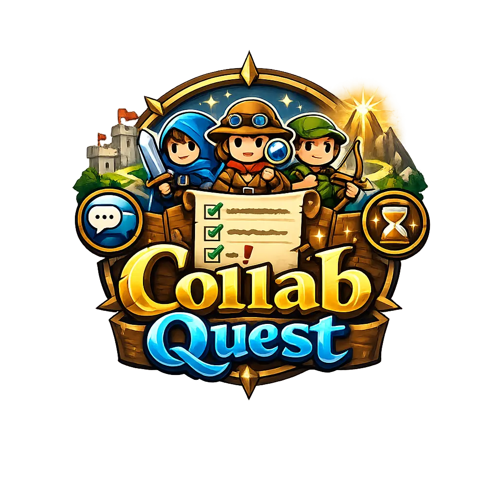

<div align="center">

  

  <h1>Collab Quest</h1>
  
  <p>A gamified collaborative task manager engineered to turn team projects into shared adventures with real-time accountability, dynamic XP, and badge unlocks.</p>

<!-- Core Frameworks -->
  
  
  
  

  <br />

  <!-- Database & State -->
  
  
  

  <br />

  <!-- Language & Validation -->
  
  

  <br />

  <!-- UI Components & Notifications -->
  
  
  

</div>

<br />

## Project Overview

Collab Quest reimagines standard, monotonous group projects by injecting game design principles into task management. Engineered for professionals, study groups, and agile teams, it transforms "to-do lists" into a dynamic ecosystem of accountability.

Instead of just checking off boxes, users earn experience points (XP), climb monthly leaderboards, unlock achievement badges (like "Speedster" and "Time-Traveler"), and utilize a unique "Nudge" system to keep teammates engaged—all backed by a robust mathematical gamification engine.

## Highlights

- **Gamification Engine:** A custom-built mathematical model governing XP curves ($30 \times Level^{1.5}$), dynamic tier scaling, and exclusive title unlocks.
- **Dynamic Leaderboards:** Multi-tiered sorting algorithms factoring in XP, volume, speed, and streaks to ensure fair, crash-proof competitive rankings that reset monthly.
- **The "Nudge" System:** A peer-to-peer accountability feature with built-in anti-spam limits (Global and Per-Task) to maintain positive engagement.
- **Admin Command Center:** High-level platform controls including global maintenance toggles, feature request tracking, and user ban ledgers.
- **State Management:** Highly optimized client-side state handling using Zustand.

## Tech Stack

| Layer / Domain                | Technologies & Libraries                         |
| :---------------------------- | :----------------------------------------------- |
| **Frontend Framework**        | Next.js 16 (App Router), React 19, TypeScript    |
| **Backend & APIs**            | Node.js, Next.js API Routes                      |
| **Database & ORM**            | MongoDB, Mongoose                                |
| **State Management**          | Zustand                                          |
| **Authentication & Security** | `jose` (JWT), `bcryptjs` (Password Hashing)      |
| **Data Validation**           | Zod (Schema Validation)                          |
| **UI & Styling**              | Tailwind CSS v4, Lucide React (Icons)            |
| **Notifications & Alerts**    | `web-push` (Out-of-app), React Toastify (In-app) |

## Getting Started

Follow these steps to run the Collab Quest environment locally.

**1. Clone the repository**

```bash
git clone [https://github.com/Abhisek-Dash-Official/collab-quest.git](https://github.com/Abhisek-Dash-Official/collab-quest.git)
cd collab-quest
```

**2. Install dependencies**

```
npm install
```

**3. Set up environment variables**

```
NEXT_PUBLIC_APP_URL=http://localhost:3000
MONGO_URI=
JWT_SECRET=
JWT_EXPIRES_IN_USER=2592000
JWT_EXPIRES_IN_ADMIN=43200
```

**4. Run the development server**

```
npm run dev
```

**Open http://localhost:3000 in your browser to start your quest.**

## Project Structure

<!-- Todo -->

## Roadmap

Based on the core user journey and application flowchart, development is structured into the following phases:

- [ ] System Architecture & Gamification Blueprints (Documentation Phase)
- [ ] MongoDB Integration & Mongoose Schema Setup
- [ ] Secure User Authentication & Session Management
- [ ] Global UI Components (Header, Footer, Navigation) & Landing Page
- [ ] Personal Workspace Dashboard (Offline Local Storage CRUD)
- [ ] Collaborative Group Workspaces & Role-Based Access Control
- [ ] Gamification Engine Implementation (XP Calculations, Leaderboards, Badges)
- [ ] Real-Time Notification & Nudge System (Web Push Integration)
- [ ] User Profiles, Account Settings, and Friend Network System
- [ ] Admin Command Center & Platform Analytics Dashboard
- [ ] Informational & Legal Pages (About, Contact, FAQ, Terms, Privacy)

## Documentation

For a deep dive into the underlying architecture and logic, refer to the core documentation files:

- [**Database Schema Architecture:**](./docs/blueprint/02-database-schema.md) Detailed breakdown of collections, foreign keys, constraints, and sub-schemas.
- [**Gamification & Math Engine:**](./docs/blueprint/03-gamification-engine.md) The mathematical foundation detailing XP multipliers, leveling curves, and badge unlock algorithms.

## Key Learnings & Methodology

- **Robust Schema Validation (Zod):** Implemented strict payload validations using `zod` to ensure that incoming API requests and form inputs structurally match the required parameters, preventing runtime type mismatches and database errors.
- **Real-Time Notification System (Web Push):** Leveraged `web-push` to implement a comprehensive, out-of-app notification engine. This handles both automated task lifecycle alerts (start times, approaching deadlines) and peer-to-peer manual "nudges," drastically improving accountability and task turnaround times.
